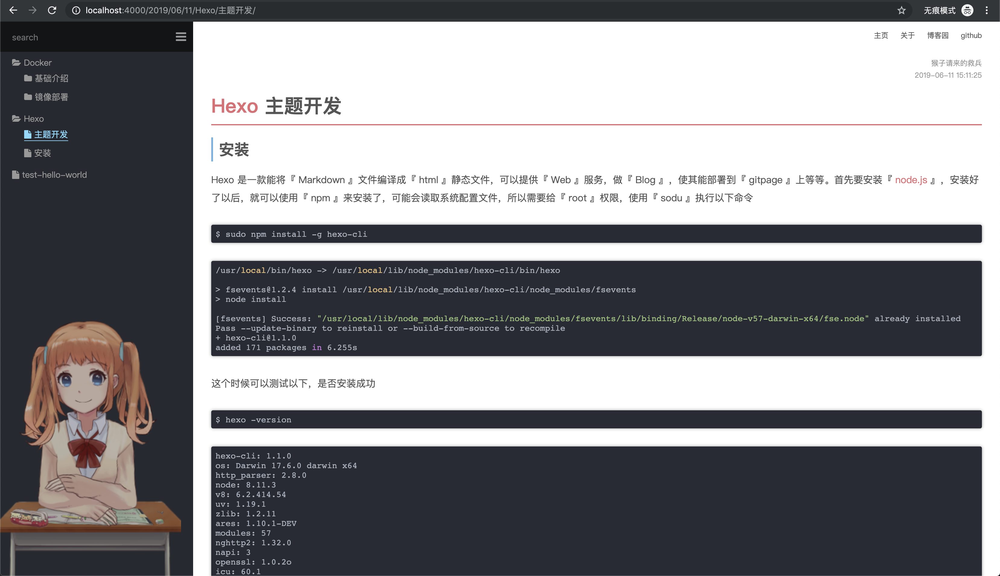

# hexo-wiki

## 介绍

为了做个自己的知识管理，用了 Hexo ，但是没有发现自己心仪的主题，就自己做了一个。

预览地址： [https://itabyss.github.io/](https://itabyss.github.io/)

教程文章：[https://www.cnblogs.com/yyhh/p/11058985.html](https://www.cnblogs.com/yyhh/p/11058985.html)




## 创建Hexo

```bash
mkdir ~/blog/hexo
cd ~/blog/hexo
hexo init
```

## 下载主题
```bash
git clone https://github.com/ITAbyss/hexo-wiki.git themes/hexo-wiki
```

## 下载必要的组件

首先得有『<a href="https://nodejs.org" target="_blank">node.js</a>』来执行『npm』

- <a href="https://www.baidu.com" target="_blank">hexo-asset-image</a> 获取文件相对路径下同名文件夹的图片

```bash
npm install hexo-directory-category --save
```

『_config.yml』其中必要修改的有以下

 ```yml
# 获取文件相对目录的图片
post_asset_folder: true

# 不需要高亮，使用了highlight.js
highlight:
    enable: false
    line_number: false
    auto_detect: false
    tab_replace:

# 修改主题
theme: hexo-wiki
 ```

